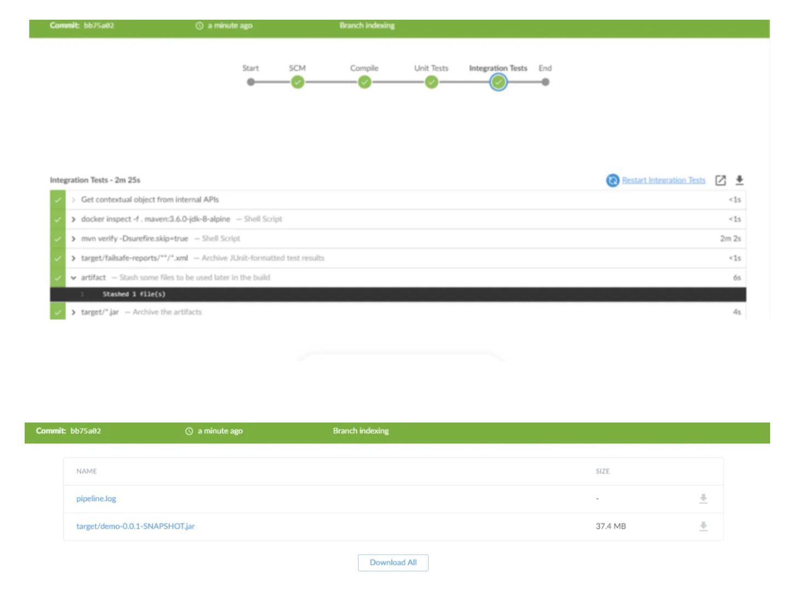

# Project
A simple Jenkins CI/CD application deployment pipeline to Kubernetes on the AWS infrastructure. Automated with Terraform 

### [Contact ]
* [Name: nho Luong]
* [Skype](luongutnho_skype)
* [Github](https://github.com/nholuongut/)
* [Linkedin](https://www.linkedin.com/in/nholuong/)
* [Email Address](luongutnho@hotmail.com) 

# License

*  Nho Luong (c) 2024
